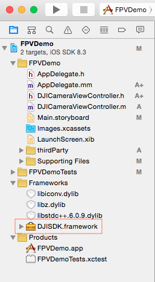
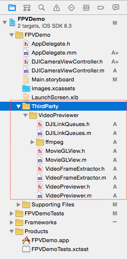
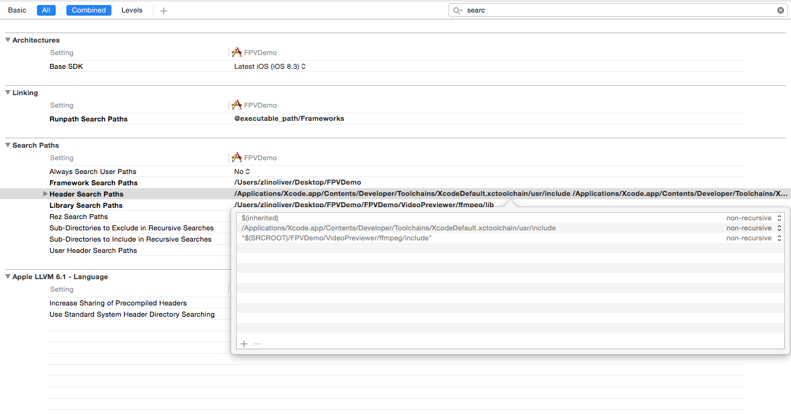
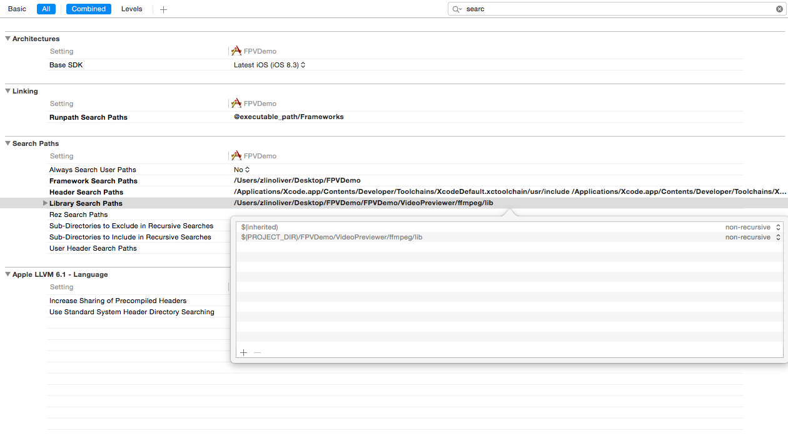
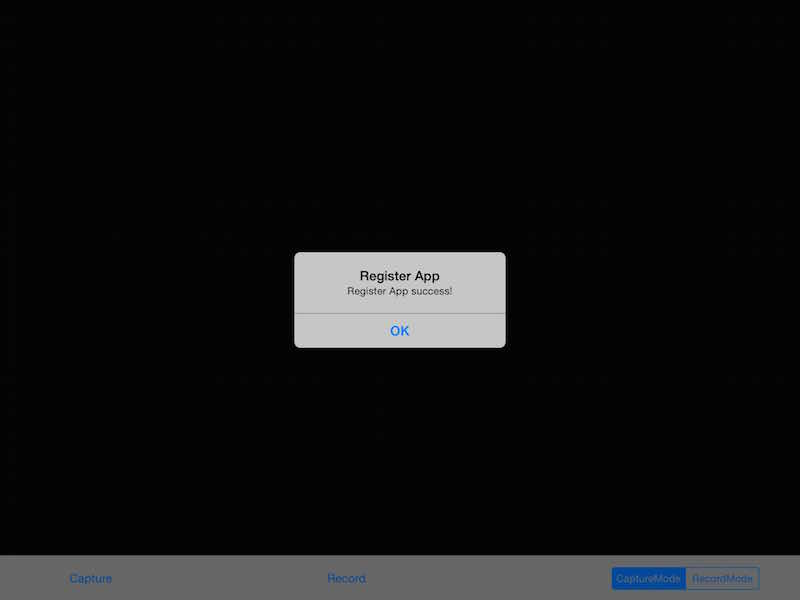

# DJI Mobile iOS SDK Tutorial

## How to create a Camera Application: Part 1/2

*Note: The code in this tutorial has been written to be run on the iPad. Please make sure you run this code on an iPad or an iPad simulator.*

This tutorial is designed for you to gain a basic understanding of the DJI Mobile SDK. It will implement the FPV view and two basic camera functionalities: **Take Photo** and **Record video**.

   You can download the entire project for this tutorial here: <https://github.com/DJI-Mobile-SDK/iOS-FPVDemo-Part1.git>

### 1. Download the SDK

You can download the latest iOS SDK from here: <https://dev.dji.com/en/products/sdk/mobile-sdk/downloads>

The development package includes:

- SDK demo project (This includes implementation of main features such as camera, gimbal control, Ground Station and Joystick)
- Documentations
- Framework

Minimum Requirement: iOS 6.1 or above

### 2. Unzip the SDK framework and import it into your project

**1**. Copy the framework **DJISDK.framework** from the **Lib** folder and copy the file to your Xcode project folder, then drag the framework to the Frameworks folder in Xcode’s project navigator as shown below:

   
   
**2**. Select the project target, in this case **FPVDemo**, and go to **Build Phases -> Link Binary With Libraries**. Click the "+" button at the bottom and add two libraries to your project: libstdc++.6.0.9.dylib and libz.dylib. These two libraries are necessay to compile the SDK framework.

**3**. Since some of the code in the SDK framework uses C++, you need to change the extension of one of the project's implementation files to "**.mm**". We use "**AppDelegate.m**" file as an example and change its name to "**AppDelegate.mm**".

**4**. **Important**: If you want to develop apps for Inspire 1 or Phantom 3 series using the SDK, MFI communications support is required.

   Let's go the project's plist file in Supporting Files folder, add the MFI protocol names as shown below:
  
   
   
### 3. Activate the SDK

**1**. Import the SDK header file by adding the following code to the top of your AppDelegate.mm file:

~~~objc
   #import <DJISDK/DJISDK.h>
~~~

**2**. Implement the **DJIAppManagerDelegate** protocol method and have it show a notification when the application registers successfully, as shown below:

~~~objc
@interface AppDelegate ()<DJIAppManagerDelegate>

@end

@implementation AppDelegate

- (BOOL)application:(UIApplication *)application didFinishLaunchingWithOptions:(NSDictionary *)launchOptions {

    NSString *appKey = @"Enter Your App Key";
    [DJIAppManager registerApp:appKey withDelegate:self];
    
    return YES;
}

#pragma mark DJIAppManagerDelegate Method
-(void)appManagerDidRegisterWithError:(int)error
{
    NSString* message = @"Register App Successed!";
    if (error != RegisterSuccess) {
        message = @"Register App Failed!";
    }else
    {
        [[NSNotificationCenter defaultCenter] postNotificationName:@"RegisterAppSuccess" object:nil];
    }
    
    UIAlertView* alertView = [[UIAlertView alloc] initWithTitle:@"Register App" message:message delegate:nil cancelButtonTitle:@"OK" otherButtonTitles:nil];	
    [alertView show];
}
~~~

---
**Note**: In the code above, you will need to obtain an App Key from the DJI Developer website **(<https://dev.dji.com/en/user/mobile-sdk>)** and enter it where it says **Enter Your App Key**. You receive an App Key by clicking **Create APP** and filling out the necessary information. Please note that **Identification Code** stands for **Bundle Identifier**. Once you do that, an App Key is generated for you. The **App Key** we generate for you is associated with the Xcode project **Bundle Identifier**, so you will not be able to use the same App Key in a different Xcode project. Each project must be submiteed individually and will receive a unique App Key. This is what you should see once you submit the information:

---

If you register app failed, you can check the **error** variable's value in the following delegate method to figure out the problem:

~~~objc
-(void)appManagerDidRegisterWithError:(int)error;
~~~

 The error code for the APP KEY activation is shown as below:
 
 result  	  | Description 
------------- | -------------
0   | Check permission successful
-1  | Cannot connect to Internet
-2  | Invalid app key
-3  | Get permission data timeout
-4  | Device uuid not match
-5  | Project package name does not match the app 	   key's identification code
-6  | App key is forbidden
-7  | Activated device number is up to the maximum 		available one
-8  | App key's platform is not correct
-9  | App key does not exist
-10 | App key has no permission
-11 | Server parser failed
-12 | Error in server obtaining uuid
-13 | Server app package name abnormal
-14 | Server parsing activation data failed
-15 | AES 256 encryption unsupported
-16 | AES 256 encryption failed
-17 | Get device uuid failed
-18 | Empty app key
-1000 | Server error 

**3**. Now run your Xcode project. If everything is OK, you will see a "Register App Successed!" alert once the application loads. Congrats for making it this far! Now we're going to walk through setting up the user interface and functionality.

### 4. Implement the FPV View
  **1**. We use the FFMPEG decoding library (found at http://ffmpeg.org) to decode the video stream. You can find the **VideoPreviewer** folder in the downloaded SDK. Copy the entire **VideoPreviewer** folder to your Xcode project's folder and then add it to the Xcode project navigator, as shown below:
  
 
 
 **2**. Go to **XCode -> Project -> Build Phases -> Link Binary With Libraries** and add the **libiconv.dylib** library. Then, set the **Header Search Paths** in **Build Settings** to the path for the **~/include** folder in the **FFMPEG** folder. Then, set the **Library Search Paths** to the path for the **~/lib** folder in the **FFMPEG** folder, as shown below:
 
  
  
  
  
  **3**. In **Main.storyboard**, add a new View Controller and call it **DJICameraViewController**. Set **DJICameraViewController** as the root View Controller for the new View Controller you just added in **Main.storyboard**:
  
  
  
Add a UIView inside the View Controller and set it as an IBOutlet called "**fpvPreviewView**". Then, add two UIButtons and one UISegmentedControl at the bottom of the View Control and set their IBOutlets and IBActions, as shown below:
  
  
  
  Go to **DJICameraViewController.m** file and import the **DJISDK** and **VideoPreviewer** header files. Then create **DJIDrone** and **DJICamera** instance variables and implement their delegate protocols as below:
  
~~~objc
#import <DJISDK/DJISDK.h>
#import "VideoPreviewer.h"

@interface DJICameraViewController ()<DJICameraDelegate, DJIDroneDelegate>
{
    DJIDrone *_drone;
    DJICamera* _camera;
}

~~~
**4**. Initialize the **DJIDrone** instance and set its type as **DJIDrone_Inspire** (you can change this type based on the UAV you have). Set the **_drone** and **_camera** instances' delegate to **self** and call the **start** method of **VideoPreviewer**'s instance in the **ViewDidLoad** method. Also, you should add an observer of **NSNotificationCenter** to check the **RegisterAppSuccess** notification, as shown below:
  
~~~objc
- (void)viewDidLoad {
    [super viewDidLoad];
    
    [[NSNotificationCenter defaultCenter] addObserver:self selector:@selector(registerAppSuccess:) name:@"RegisterAppSuccess" object:nil];
    _drone = [[DJIDrone alloc] initWithType:DJIDrone_Inspire];
    _drone.delegate = self;
    _camera = _drone.camera;
    _camera.delegate = self;
    
    [[VideoPreviewer instance] start];
    
}

- (void)registerAppSuccess:(NSNotification *)notification
{
    
    NSLog(@"registerAppSuccess");
    [_drone connectToDrone];
    [_camera startCameraSystemStateUpdates];
    
}

~~~
  
 Moreover, in the **viewWillAppear** method, set **fpvPreviewView** instance as a View of **VideoPreviewer** to show the Video Stream and reset it to nil in the **viewWillDisappear** method:
 
~~~objc
- (void)viewWillAppear:(BOOL)animated
{
    [super viewWillAppear:animated];
    
    [_drone connectToDrone];
    [_camera startCameraSystemStateUpdates];
    [[VideoPreviewer instance] setView:self.fpvPreviewView];
    
}

- (void)viewWillDisappear:(BOOL)animated
{
    
    [super viewWillDisappear:animated];
    [_camera stopCameraSystemStateUpdates];
    [_drone disconnectToDrone];
    [[VideoPreviewer instance] setView:nil];
    
}
~~~
  
  Lastly, implement the **DJICameraDelegate** methods, as shown below:
  
~~~objc
#pragma mark - DJICameraDelegate

-(void) camera:(DJICamera*)camera didReceivedVideoData:(uint8_t*)videoBuffer length:(int)length
{
    uint8_t* pBuffer = (uint8_t*)malloc(length);
    memcpy(pBuffer, videoBuffer, length);
    [[VideoPreviewer instance].dataQueue push:pBuffer length:length];
}

-(void) camera:(DJICamera*)camera didUpdateSystemState:(DJICameraSystemState*)systemState
{
    if (!systemState.isTimeSynced) { //Only for Phantom 2 Vision/Phantom 2 Vision+ to check camera time
        [_camera syncTime:nil];
    }
    if (systemState.isUSBMode) { //Only for Phantom 2 Vision/Phantom 2 Vision+ to keep cameraMode when systemState is under USBMode
        [_camera setCamerMode:CameraCameraMode withResultBlock:Nil];
    }
    
}

-(void) droneOnConnectionStatusChanged:(DJIConnectionStatus)status
{
    if (status == ConnectionSuccessed) {
        NSLog(@"Connection Successed");
    }
    else if(status == ConnectionStartConnect)
    {
        NSLog(@"Start Reconnect");
    }
    else if(status == ConnectionBroken)
    {
        NSLog(@"Connection Broken");
    }
    else if (status == ConnectionFailed)
    {
        NSLog(@"Connection Failed");
    }
}

~~~
   -(void) camera:(DJICamera*)camera didReceivedVideoData:(uint8_t*)videoBuffer length:(int)length method is used to send the video stream to **VideoPreviewer** to decode.
   
   -(void) camera:(DJICamera*)camera didUpdateSystemState:(DJICameraSystemState*)systemState method is used to get the camera state from the camera on your aircraft. It will be called frequently, so you can update your user interface or camera settings accordingly here.
   
   -(void) droneOnConnectionStatusChanged:(DJIConnectionStatus)status method is used to check the drone's connection.
   
  **5**. Build and Run the project in Xcode to check if everything is okay. If you see the following screenshot as below, then you can start connect to your aircraft and enjoy the video stream from its camera!
  
  
  
### 5. Connect to your DJI Aircraft
After you finish the steps above, you can now connect your mobile device to your DJI Aircraft to use the application, like checking the FPV View. Here are the guidelines:

* In order to connect to a DJI Inspire 1, Phantom 3 Professional or Phantom 3 Advanced:

  **1**. First, turn on your remote controller.
  
  **2**. Then, turn on the power of the DJI aircraft.
  
  **3**. Connect your iOS device to the remote controller using the lightning cable.
  
  **4**. Trust the device if an alert asking “Do you trust this device” comes up.
  
  **5**. Now you will be able to view the live video stream from your aircraft's camera based on what we've finished of the application so far!

* In order to connect to a DJI Phantom 2 Vision+ or Phantom 2 Vision:

  **1**. First, turn on your remote controller.
  
  **2**. Then, turn on the power of the DJI aircraft.
  
  **3**. Turn on the Wi-Fi range extender.
  
  **4**. Turn on the Wi-Fi on your mobile device and connect to the network named Phantom-xxxxxx (where xxxxxx is your range extender’s SSID number).
  
  **5**. Now, you will able to view the live video stream from your aircraft's camera based on what we've finished of the application so far!
  
  
### 6. Enjoy the FPV View

If you can see the live video stream in the application, congratulations! Feel free to move on to Part 2 of this demo application tutorial, where we will finish the application.

  

### 7. Where To Go From Here?
   
   You’ve learned how to setup the DJI Mobile SDK's development environment and use it to create a camera view that shows the live video stream of the aircraft's camera. We will add the capture photo and record video functionalities of the app in [Part 2](../Part2/FPVDemo_Part2_en.md) of this tutorial. Hope you enjoy! 
