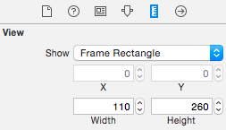
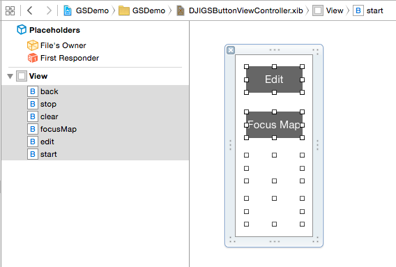
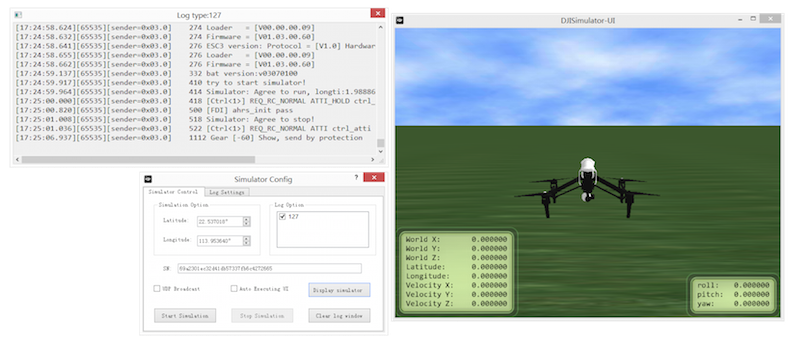
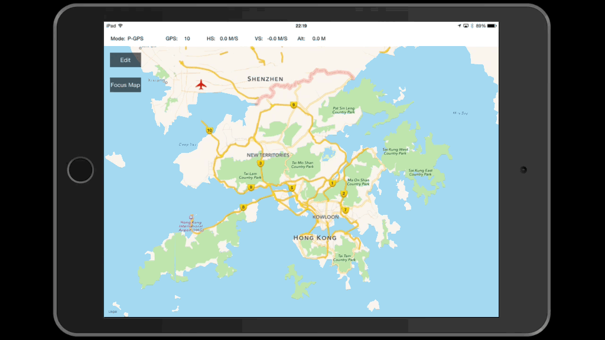
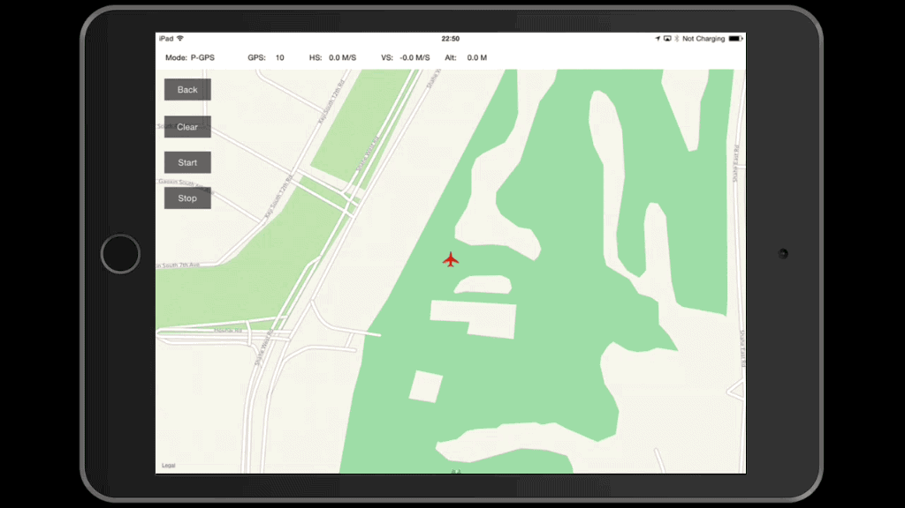
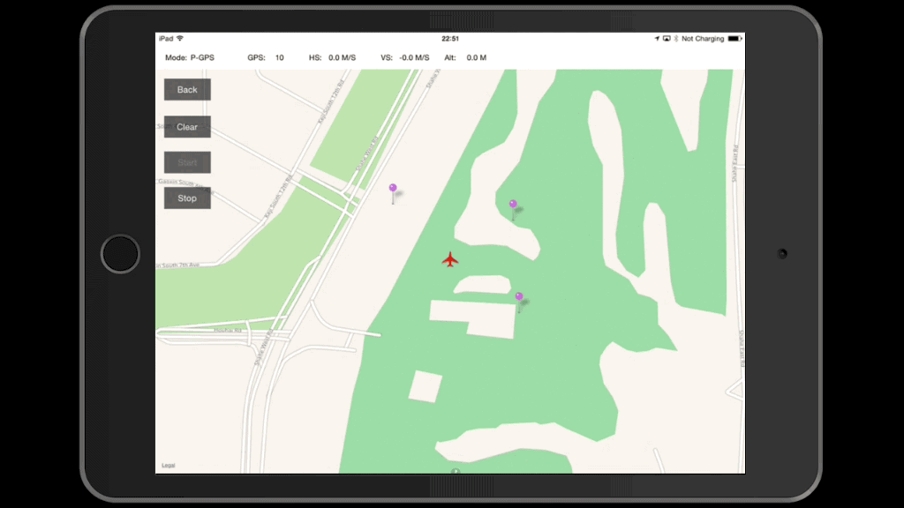

# DJI Mobile iOS SDK 教程

# 如何创建一个地图和地面站预设航点功能App: 第二部分

在此教程里，你将学会如何实现地面站预设航点功能. 在地面站的三个功能中(预设航点，热点环绕，跟随), 预设航点是地面站中最复杂也是最常用的功能. 如果你还没有阅读本教程的第一部分，请先从[这里](../Part1/GSDemo-Part1_en.md)阅读. 我们开始吧!

   你可以在[此处](https://github.com/DJI-Mobile-SDK/iOS-GSDemo-Part2.git)下载到本教程第二部分的demo工程.
   
## 1. 重构UI

在本教程第一部分中，代码的结构比较简单而且不够健壮. 为了便于本教程代码工程的继续开发，这里需要重构下代码，而且加入更多的UI元素. 

#### **1**. 添加新的UIButton

首先，我们新建一个的名为**DJIGSButtonController**的**UIViewController**的子类. 确保你在创建文件时勾选上 **Also create XIB file**. 然后打开 DJIGSButtonController.xib 文件，并在Simulated Metrics部分的**Size**选项中选择 **Freeform** .在View部分，调整宽度为 **110**， 高为 **260**. 请看下面的效果图:

接下来，拖动六个按钮到**DJIGSButtonViewController.xib**上，并将它们的名字改为 **Edit**, **Back**, **Clear**, **Focus Map**, **Start** 和 **Stop**. Edit 覆盖在Back上面, Focus Map覆盖在Clear上面. 并且确保 **Back**, **Clear**, **Start** 和 **Stop** 按钮是隐藏状态.

 然后在**DJIGSButtonViewController.h**文件里为六个按钮添加IBOutlets 和 IBActions. 同时，我们将加入一个名为 **DJIGSViewMode**的枚举值，用来记录app的两种工作模式(View和Edit). 接着，我们添加几个delegate方法，用于响应IBAction的方法调用. 最后，加入一个 **- (void)switchToMode:(DJIGSViewMode)mode inGSButtonVC:(DJIGSButtonViewController *)GSBtnVC;** 方法，当DJIGSViewMode的值改变时，更新多个按钮的状态. 请看下面的代码:
 
 ~~~objc
 #import <UIKit/UIKit.h>
 
 typedef NS_ENUM(NSUInteger, DJIGSViewMode) {
    DJIGSViewMode_ViewMode,
    DJIGSViewMode_EditMode,
};

@class DJIGSButtonViewController;

@protocol DJIGSButtonViewControllerDelegate <NSObject>

- (void)stopBtnActionInGSButtonVC:(DJIGSButtonViewController *)GSBtnVC;
- (void)clearBtnActionInGSButtonVC:(DJIGSButtonViewController *)GSBtnVC;
- (void)focusMapBtnActionInGSButtonVC:(DJIGSButtonViewController *)GSBtnVC;
- (void)startBtnActionInGSButtonVC:(DJIGSButtonViewController *)GSBtnVC;

- (void)switchToMode:(DJIGSViewMode)mode inGSButtonVC:(DJIGSButtonViewController *)GSBtnVC;
@end

@interface DJIGSButtonViewController : UIViewController

@property (weak, nonatomic) IBOutlet UIButton *backBtn;
@property (weak, nonatomic) IBOutlet UIButton *stopBtn;
@property (weak, nonatomic) IBOutlet UIButton *clearBtn;
@property (weak, nonatomic) IBOutlet UIButton *focusMapBtn;
@property (weak, nonatomic) IBOutlet UIButton *editBtn;
@property (weak, nonatomic) IBOutlet UIButton *startBtn;

@property (assign, nonatomic) DJIGSViewMode mode;
@property (weak, nonatomic) id <DJIGSButtonViewControllerDelegate> delegate;

- (IBAction)backBtnAction:(id)sender;
- (IBAction)stopBtnAction:(id)sender;
- (IBAction)clearBtnAction:(id)sender;
- (IBAction)focusMapBtnAction:(id)sender;
- (IBAction)editBtnAction:(id)sender;
- (IBAction)startBtnAction:(id)sender;

@end
 ~~~
 
 当你完成后，打开 **DJIGSButtonViewController.m** 文件，替换已有的代码为以下代码:
 
 ~~~objc
 #import "DJIGSButtonViewController.h"

@implementation DJIGSButtonViewController

- (void)viewDidLoad {
    [super viewDidLoad];
    [self setMode:DJIGSViewMode_ViewMode];
}

- (void)didReceiveMemoryWarning {
    [super didReceiveMemoryWarning];
    // Dispose of any resources that can be recreated.
}

#pragma mark - Property Method
- (void)setMode:(DJIGSViewMode)mode
{
    _mode = mode;
    [_editBtn setHidden:(mode == DJIGSViewMode_EditMode)];
    [_focusMapBtn setHidden:(mode == DJIGSViewMode_EditMode)];
    [_backBtn setHidden:(mode == DJIGSViewMode_ViewMode)];
    [_clearBtn setHidden:(mode == DJIGSViewMode_ViewMode)];
    [_startBtn setHidden:(mode == DJIGSViewMode_ViewMode)];
    [_stopBtn setHidden:(mode == DJIGSViewMode_ViewMode)];
}

#pragma mark - IBAction Methods
- (IBAction)backBtnAction:(id)sender {
    [self setMode:DJIGSViewMode_ViewMode];
    if ([_delegate respondsToSelector:@selector(switchToMode:inGSButtonVC:)]) {
        [_delegate switchToMode:self.mode inGSButtonVC:self];
    }
}

- (IBAction)stopBtnAction:(id)sender {
 
    if ([_delegate respondsToSelector:@selector(stopBtnActionInGSButtonVC:)]) {
        [_delegate stopBtnActionInGSButtonVC:self];
    }
}

- (IBAction)clearBtnAction:(id)sender {
    
    if ([_delegate respondsToSelector:@selector(clearBtnActionInGSButtonVC:)]) {
        [_delegate clearBtnActionInGSButtonVC:self];
    }
}

- (IBAction)focusMapBtnAction:(id)sender {
    
    if ([_delegate respondsToSelector:@selector(focusMapBtnActionInGSButtonVC:)]) {
        [_delegate focusMapBtnActionInGSButtonVC:self];
    }
}

- (IBAction)editBtnAction:(id)sender {
    
    [self setMode:DJIGSViewMode_EditMode];
    if ([_delegate respondsToSelector:@selector(switchToMode:inGSButtonVC:)]) {
        [_delegate switchToMode:self.mode inGSButtonVC:self];
    }
}

- (IBAction)startBtnAction:(id)sender {
    
    if ([_delegate respondsToSelector:@selector(startBtnActionInGSButtonVC:)]) {
        [_delegate startBtnActionInGSButtonVC:self];
    }
}

@end
 ~~~
 
 这些改变使得代码架构变得更加简洁与健壮，这将会方便以后的维护.
 
 现在，我们回到 **DJIRootViewController.h** 文件并删除 **editButton** IBOutlet,  **resetPointsAction** 方法, 以及  **focusMapAction** 方法. 删除这些以后，创建一个名为 "topBarView" 的UIView IBOutlet并将其连接到 **Main.storyboard**的 RootViewController的对应View上, 如下所示:
 
 
 
 然后打开 DJIRootViewController.m 文件, 导入**DJIGSButtonViewController.h**头文件. 接着创建一个DJIGSButtonViewController类型的属性并命名为 **gsButtonVC**，然后在类里实现 DJIGSButtonViewController的 **DJIGSButtonViewControllerDelegate** 协议:
 
~~~objc
#import "DJIRootViewController.h"
#import "DJIGSButtonViewController.h"

#define kEnterNaviModeFailedAlertTag 1001

@interface DJIRootViewController ()<DJIGSButtonViewControllerDelegate>
@property (nonatomic, assign)BOOL isEditingPoints;
@property (nonatomic, strong)DJIGSButtonViewController *gsButtonVC;
@end
~~~

下一步，初始化**initUI**方法里的 **gsButtonVC** 属性并将原来的 **focusMapAction** 方法中的代码移到一个名为 **focusMap**的新方法里, 如下所示:

~~~objc
self.gsButtonVC = [[DJIGSButtonViewController alloc] initWithNibName:@"DJIGSButtonViewController" bundle:[NSBundle mainBundle]];
[self.gsButtonVC.view setFrame:CGRectMake(0, self.topBarView.frame.origin.y + self.topBarView.frame.size.height, self.gsButtonVC.view.frame.size.width, self.gsButtonVC.view.frame.size.height)];
self.gsButtonVC.delegate = self;
[self.view addSubview:self.gsButtonVC.view];
~~~

~~~objc
- (void)focusMap
{
    if (CLLocationCoordinate2DIsValid(self.droneLocation)) {
        MKCoordinateRegion region = {0};
        region.center = self.droneLocation;
        region.span.latitudeDelta = 0.001;
        region.span.longitudeDelta = 0.001;
        
        [self.mapView setRegion:region animated:YES];
    }
}
~~~

最后，实现 **DJIGSButtonViewController**的 delegate 方法, 如下所示:

~~~objc
#pragma mark - DJIGSButtonViewController Delegate Methods
- (void)stopBtnActionInGSButtonVC:(DJIGSButtonViewController *)GSBtnVC
{
}

- (void)clearBtnActionInGSButtonVC:(DJIGSButtonViewController *)GSBtnVC
{
    [self.mapController cleanAllPointsWithMapView:self.mapView];
}

- (void)focusMapBtnActionInGSButtonVC:(DJIGSButtonViewController *)GSBtnVC
{
    [self focusMap];
}

- (void)startBtnActionInGSButtonVC:(DJIGSButtonViewController *)GSBtnVC
{
}

- (void)switchToMode:(DJIGSViewMode)mode inGSButtonVC:(DJIGSButtonViewController *)GSBtnVC
{
    if (mode == DJIGSViewMode_EditMode) {
         self.isEditingPoints = YES;
        [self focusMap];
    }else
    {
         self.isEditingPoints = NO;
    }
}
~~~

在 **- (void)switchToMode:(DJIGSViewMode)mode inGSButtonVC:(DJIGSButtonViewController *)GSBtnVC** delegate方法里, 我们调用 **focusMap** 方法. 进行这样的操作，我们可以实现在按下edit按钮时，将地图定位到飞机的位置，省去用户每次都需要放大地图才能编辑的麻烦，提升用户体验. 同时，当应用在edit模式下,  **isEditingPoints**属性的值会被设置为 **YES**. 

现在，我们编译并运行该工程，并尝试按下**Edit** 和 **Back** 按钮. 以下是当你按下按钮时的动画:

## 2. 设置 DJIGroundStationWaypoint 和 DJIGroundStationTask

#### **1**. DJIGroundStationWaypoint

我们先看下 **DJIGroundStationWaypoint.h** 文件. 比如说，你可以使用: 

~~~objc
-(id) initWithCoordinate:(CLLocationCoordinate2D)coordinate;
~~~
来创建一个有特定坐标的waypoint对象. 当你创建了waypoint后，可以通过调用以下代码，向其添加一个**DJIWaypointAction**:

~~~objc
-(BOOL) addWaypointAction:(DJIWaypointAction*)action;
~~~

更进一步的，有了waypoints，你可以设置坐标，高度，朝向，水平速度甚至更多参数. 要了解更多细节，请查看*DJIGroundStationWaypoint.h** 头文件.

#### **2**. DJIGroundStationTask

当你想要开始一个GroundStation Waypoint 任务（Task）时，你需要使用**DJIGroundStationTask**. 你可以调用它的类方法 **+(id) newTask;** 来直接创建一个新任务. 一旦你创建好了任务，你可以使用下面的方法来添加 **DJIGroundStationWaypoint** 类型的waypoint: 

~~~objc
-(void) addWaypoint:(DJIGroundStationWaypoint*)waypoint;
~~~

相反地, 你也可以调用以下方法来删除任务中的waypoint:

~~~objc
-(void) removeWaypoint:(DJIGroundStationWaypoint*)waypoint;
~~~
 
 更多的, 你可以设置**DJIGroundStationTask**的 **isLoop** 属性来决定是否循环执行任务. 同时，你可以设置类型为**DJIGSTaskFinishedAction**枚举值的**finishedAction** 属性，来设置飞机完成任务后要进行的动作. 最后，你可以设置类型为**DJIGSHeadingMode**枚举值的 **headingMode** 属性来设置飞机执行任务时的机头朝向. 下面是一部分头文件内容:
 
~~~objc
/**
 *  Action of task when finished
 */
typedef NS_ENUM(NSUInteger, DJIGSTaskFinishedAction){
    /**
     *  No action. aircraft will stay at the last waypoint
     */
    GSTaskFinishedNoAction,
    /**
     *  Aircraft will go home
     */
    GSTaskFinishedGoHome,
    /**
     *  Aircraft will auto landing
     */
    GSTaskFinishedAutoLanding,
    /**
     *  Aircraft will go to the first waypoint
     */
    GSTaskFinishedGoFirstWaypoint
};

/**
 *  Heading mode
 */
typedef NS_ENUM(NSUInteger, DJIGSHeadingMode){
    /**
     *  Aircraft's heading toward to the next waypoint
     */
    GSHeadingTowardNexWaypoint,
    /**
     *  Aircraft's heading using the initial direction
     */
    GSHeadingUsingInitialDirection,
    /**
     *  Aircraft's heading control by the remote controller
     */
    GSHeadingControlByRemoteController,
    /**
     *  Aircraft's heading using the waypoint's heading value
     */
    GSHeadingUsingWaypointHeading,
};

/**
 *  Whether execute task looply. Default is NO
 */
@property(nonatomic, assign) BOOL isLoop;

/**
 *  Action for the aircraft while the task finished
 */
@property(nonatomic, assign) DJIGSTaskFinishedAction finishedAction;

/**
 *  How the aircraft heading while executing task
 */
@property(nonatomic, assign) DJIGSHeadingMode headingMode;

/**
 *  Create new task
 *
 */
+(id) newTask;

/**
 *  Add waypoint
 *
 *  @param waypoint
 */
-(void) addWaypoint:(DJIGroundStationWaypoint*)waypoint;

/**
 *  Remove one waypoint
 *
 *  @param waypoint Waypoint will be removed
 */
-(void) removeWaypoint:(DJIGroundStationWaypoint*)waypoint;

~~~
 
更多细节，请在DJI Mobile SDK中查看 **DJIGroundStationTask.h** 头文件.

#### **3**. 创建 DJIWaypointConfigViewController

在此demo中，我们假设所有加入地图中的waypoint的参数设置都是一样的. 

现在，我们创建一个新的ViewController来让用户设置waypoint的参数. 来到Xcode的project navigator，右键点击 **GSDemo** 文件夹, 选择 **New File...**, 将它的子类设置为 **UIViewController**, 命名其为 "DJIWaypointConfigViewController", 然后确保 "Also create XIB file" 为已选状态. 接着，打开 **DJIWaypointConfigViewController.xib** 文件并实现UI, 如下所示:

在Waypoint Configuration ViewController里, 我们使用UITextField来让用户设置DJIGroundStationWaypoint实例的**altitude**属性. 然后，用一个UISwitcher来设置DJIGroundStationTask 实例的**isLoop** 属性, 它会用来开启或关闭任务是否重复执行的设定. 接下来，有三个UISegmentedControl控件来设置三个实例的属性，包括DJIGroundStationWaypoint实例的 **horizontalVelocity** 属性, DJIGroundStationTask实例的 **finishedAction** 属性,以及**DJIGroundStationTask** 实例的 **headingMode** 属性. 

在最下面，我们加入了两个UIButton响应 **Cancel** 和 **Finish** 方法. 更多设置的细节，比如视图Frame的位置，Frame的大小，以及每个UI元素的背景颜色，请查看本教程源代码里的 **DJIWaypointConfigViewController.xib** 文件.

现在，我们为**DJIWaypointConfigViewController.h**文件里的每一个UI元素创建对应的IBOutlets 和 IBActions, 如下所示:

~~~objc
#import <UIKit/UIKit.h>

@class DJIWaypointConfigViewController;

@protocol DJIWaypointConfigViewControllerDelegate <NSObject>

- (void)cancelBtnActionInDJIWaypointConfigViewController:(DJIWaypointConfigViewController *)waypointConfigVC;
- (void)finishBtnActionInDJIWaypointConfigViewController:(DJIWaypointConfigViewController *)waypointConfigVC;

@end

@interface DJIWaypointConfigViewController : UIViewController

@property (weak, nonatomic) IBOutlet UITextField *altitudeTextField;
@property (weak, nonatomic) IBOutlet UISwitch *repeatSwitcher;
@property (weak, nonatomic) IBOutlet UISegmentedControl *speedSegmentedControl;
@property (weak, nonatomic) IBOutlet UISegmentedControl *actionSegmentedControl;
@property (weak, nonatomic) IBOutlet UISegmentedControl *headingSegmentedControl;

@property (weak, nonatomic) id <DJIWaypointConfigViewControllerDelegate>delegate;

- (IBAction)cancelBtnAction:(id)sender;
- (IBAction)finishBtnAction:(id)sender;

@end
~~~

这里，我们还创建了两个 **DJIWaypointConfigViewControllerDelegate** delegate 方法，用来响应 **Cancel** 和 **Finish** 两个按钮被按下的事件.

接着，我们用以下代码替换掉** DJIWaypointConfigViewController.m** 文件里的代码:

~~~objc
#import "DJIWaypointConfigViewController.h"

@interface DJIWaypointConfigViewController ()

@end

@implementation DJIWaypointConfigViewController

- (void)viewDidLoad {
    [super viewDidLoad];

    [self initUI];   
}

- (void)didReceiveMemoryWarning {
    [super didReceiveMemoryWarning];
    // Dispose of any resources that can be recreated.
}

- (void)initUI
{
    self.altitudeTextField.text = @"50";
    [self.repeatSwitcher setOn:NO animated:YES]; //Turn off it to cancel execute GroundStation Task looply
    [self.speedSegmentedControl setSelectedSegmentIndex:1]; //Set the horizontal speed to Mid
    [self.actionSegmentedControl setSelectedSegmentIndex:1]; //Set the finishAction to GSTaskFinishedGoHome
    [self.headingSegmentedControl setSelectedSegmentIndex:0]; //Set the headingMode to GSHeadingTowardNexWaypoint
    
}

- (IBAction)cancelBtnAction:(id)sender {
 
    if ([_delegate respondsToSelector:@selector(cancelBtnActionInDJIWaypointConfigViewController:)]) {
        [_delegate cancelBtnActionInDJIWaypointConfigViewController:self];
    }
}

- (IBAction)finishBtnAction:(id)sender {
    
    if ([_delegate respondsToSelector:@selector(finishBtnActionInDJIWaypointConfigViewController:)]) {
        [_delegate finishBtnActionInDJIWaypointConfigViewController:self];
    }
}

@end
~~~

在以上代码中, 我们创建了一个用来初始化UI控件的 **initUI** 方法, 它会在**viewDidload**方法里被调用. 比如说，我们将 **altitudeTextField** 的默认文本设置为 **50**, 这样用户就不需要在第一次打开程序时输入自定义的高度数值. 他们可以马上按下 **Finish** 键，而不需要在开始前做设定操作。

## 3. 设置地面站任务

#### **1**. 添加 **DJIWaypointConfigViewController** 到 **DJIRootViewController**中

现在，我们来到 **DJIRootViewController.m** 文件中, 在顶部添加 **DJIWaypointConfigViewController.h** 头文件, 然后创建一个类型为**DJIWaypointConfigViewController**的属性，将它命名为“waypointConfigVC”. 然后，实现 **DJIWaypointConfigViewControllerDelegate** 协议, 如下所示:

~~~objc
#import "DJIRootViewController.h"
#import "DJIGSButtonViewController.h"
#import "DJIWaypointConfigViewController.h"

#define kEnterNaviModeFailedAlertTag 1001

@interface DJIRootViewController ()<DJIGSButtonViewControllerDelegate, DJIWaypointConfigViewControllerDelegate>
@property (nonatomic, assign)BOOL isEditingPoints;
@property (nonatomic, strong)DJIGSButtonViewController *gsButtonVC;
@property (nonatomic, strong)DJIWaypointConfigViewController *waypointConfigVC;
@end
~~~

接下来，我们加入一些代码来初始化**waypointConfigVC**实例变量并在 initUI 方法的底部将它的delegate设置为**DJIRootViewController**:

~~~objc
-(void) initUI
{
    self.modeLabel.text = @"N/A";
    self.gpsLabel.text = @"0";
    self.vsLabel.text = @"0.0 M/S";
    self.hsLabel.text = @"0.0 M/S";
    self.altitudeLabel.text = @"0 M";
    
    self.gsButtonVC = [[DJIGSButtonViewController alloc] initWithNibName:@"DJIGSButtonViewController" bundle:[NSBundle mainBundle]];
    [self.gsButtonVC.view setFrame:CGRectMake(0, self.topBarView.frame.origin.y + self.topBarView.frame.size.height, self.gsButtonVC.view.frame.size.width, self.gsButtonVC.view.frame.size.height)];
    self.gsButtonVC.delegate = self;
    [self.view addSubview:self.gsButtonVC.view];
    
    self.waypointConfigVC = [[DJIWaypointConfigViewController alloc] initWithNibName:@"DJIWaypointConfigViewController" bundle:[NSBundle mainBundle]];
    self.waypointConfigVC.view.alpha = 0;
    self.waypointConfigVC.view.center = self.view.center;
    self.waypointConfigVC.delegate = self;
    [self.view addSubview:self.waypointConfigVC.view];
    
}
~~~

在以上代码中，我们将**waypointConfigVC**的view的 **alpha** 属性设置为零，来隐藏该view. 接下来，将它的位置设置为 **DJIRootViewController**的view的中心.

更进一步的，实现 **DJIWaypointConfigViewControllerDelegate** 的两个方法, 如下所示:

~~~objc
#pragma mark - DJIWaypointConfigViewControllerDelegate Methods

- (void)cancelBtnActionInDJIWaypointConfigViewController:(DJIWaypointConfigViewController *)waypointConfigVC
{
    __weak DJIRootViewController *weakSelf = self;
    
    [UIView animateWithDuration:0.25 animations:^{
        weakSelf.waypointConfigVC.view.alpha = 0;
    }];
}

- (void)finishBtnActionInDJIWaypointConfigViewController:(DJIWaypointConfigViewController *)waypointConfigVC
{
    __weak DJIRootViewController *weakSelf = self;
    
    [UIView animateWithDuration:0.25 animations:^{
        weakSelf.waypointConfigVC.view.alpha = 0;
    }];

}
~~~

在第一个delegate方法中, 我们用一个UIView的类方法，来动态改变waypointConfigVC的view的**alpha**数值:

~~~objc
+ (void)animateWithDuration:(NSTimeInterval)duration animations:(void (^)(void))animations NS_AVAILABLE_IOS(4_0);
~~~

在第二个 delegate 方法中, 我们做同样的事情.

最后，将

~~~objc
- (void)startBtnActionInGSButtonVC:(DJIGSButtonViewController *)GSBtnVC;
~~~
方法里的代码替换为以下代码，实现在用户按下**start** 按钮时显示**waypointConfigVC**的view的功能:

~~~objc
- (void)startBtnActionInGSButtonVC:(DJIGSButtonViewController *)GSBtnVC
{
    __weak DJIRootViewController *weakSelf = self;

    [UIView animateWithDuration:0.25 animations:^{
        weakSelf.waypointConfigVC.view.alpha = 1.0;
    }];
        
}
~~~

当这些都完成后，我们来编译运行下工程. 尝试按下**Edit** 按钮和 **Start** 按钮来显示**waypointConfigVC**的view:

#### **2**. 操作地面站任务

现在，我们回到 **DJIRootViewController.h** 文件. 首先，在interface里实现 **GroundStationDelegate** 和 **DJINavigationDelegate** 协议. 然后，创造一个**DJIGroundStationTask**类型的属性并将其命名为 “gsTask”. 同时，创建一个**UIAlertView**类型的属性并将其命名为”uploadProgressView“. UIAlertView将会被用来显示地面站任务的执行状态. 完整的DJIRootViewController头文件代码如下所示:

~~~objc
#import <UIKit/UIKit.h>
#import <DJISDK/DJISDK.h>
#import "DJIMapController.h"
#import <MapKit/MapKit.h>
#import <CoreLocation/CoreLocation.h>

@interface DJIRootViewController : UIViewController<MKMapViewDelegate, CLLocationManagerDelegate, DJIDroneDelegate, DJIMainControllerDelegate, GroundStationDelegate, DJINavigationDelegate>

@property (nonatomic, strong) DJIMapController *mapController;
@property (weak, nonatomic) IBOutlet MKMapView *mapView;
@property(nonatomic, strong) CLLocationManager* locationManager;
@property(nonatomic, assign) CLLocationCoordinate2D userLocation;
@property(nonatomic, assign) CLLocationCoordinate2D droneLocation;
@property (nonatomic, strong) UITapGestureRecognizer *tapGesture;

@property (weak, nonatomic) IBOutlet UIView *topBarView;

@property(nonatomic, strong) IBOutlet UILabel* modeLabel;
@property(nonatomic, strong) IBOutlet UILabel* gpsLabel;
@property(nonatomic, strong) IBOutlet UILabel* hsLabel;
@property(nonatomic, strong) IBOutlet UILabel* vsLabel;
@property(nonatomic, strong) IBOutlet UILabel* altitudeLabel;

@property(nonatomic, strong) DJIDrone* inspireDrone;
@property(nonatomic, strong) DJIInspireMainController* inspireMainController;

@property(nonatomic, strong) DJIGroundStationTask* gsTask;
@property(nonatomic, strong) UIAlertView* uploadProgressView;

@end
~~~

接下来，来到 DJIRootViewController.m 文件并设置 **inspireMainController** 实例变量的 **groundStationDelegate** 和 **navigationDelegate** 为 DJIRootViewController， 如下所示:

~~~objc
- (void)initDrone
{
    self.inspireDrone = [[DJIDrone alloc] initWithType:DJIDrone_Inspire];
    self.inspireMainController = (DJIInspireMainController*)self.inspireDrone.mainController;
    self.inspireDrone.delegate = self;
    self.inspireMainController.mcDelegate = self;
    self.inspireMainController.groundStationDelegate = self;
    self.inspireMainController.navigationDelegate = self;
}
~~~

更进一步地，在**startBtnActionInGSButtonVC** delegate方法下方加入以下代码:

~~~objc
- (void)startBtnActionInGSButtonVC:(DJIGSButtonViewController *)GSBtnVC
{
    __weak DJIRootViewController *weakSelf = self;

    [UIView animateWithDuration:0.25 animations:^{
        weakSelf.waypointConfigVC.view.alpha = 1.0;
    }];
    
    NSArray* wayPoints = self.mapController.wayPoints;
    if (wayPoints == nil || wayPoints.count == 0) {
        UIAlertView *alert = [[UIAlertView alloc] initWithTitle:@"No waypoint for mission" message:@"" delegate:self cancelButtonTitle:@"OK" otherButtonTitles:nil];
        [alert show];
        return;
    }

    self.gsTask = [DJIGroundStationTask newTask];
    for (int i = 0; i < wayPoints.count; i++) {
        CLLocation* location = [wayPoints objectAtIndex:i];
        if (CLLocationCoordinate2DIsValid(location.coordinate)) {
            DJIGroundStationWaypoint* waypoint = [[DJIGroundStationWaypoint alloc] initWithCoordinate:location.coordinate];
            [self.gsTask addWaypoint:waypoint];
        }
    }
    
}
~~~

以上新加入的代码中, 我们创建了一个局部 **NSArray** 变量，并命名它为 “wayPoints”， 并将它的数值设置为 mapController 的 **wayPoints** 数组. 接下来，查看数组是否存在或者数组是否为空. 如果它为空或者不存在, 显示UIAlertView告知用户知道此任务里没有航点. 

#####重要事项: 为了安全，在任务开始前加入逻辑来查看GPS卫星的数量非常重要，此操作已在本教程的第一部分中提到过. 如果卫星数量小于6，你应该阻止用户开始地面站任务并且显示警告信息. 因为这里我们用 DJI PC 模拟器, 我们在一个完美的条件下测试应用，GPS卫星数量会一直是10.

下一步，我们用DJIGroundStationTask的**newTask**类方法来初始化**gsTask** 实例变量. 然后，我们用一个for循环来获取每一个wayPoints数组的waypoint的**CLLocation**参数，并且用以下方法检查它的 **coordinate** 是否有效:

~~~objc
BOOL CLLocationCoordinate2DIsValid(CLLocationCoordinate2D coord);
~~~

最后，如果coordinate（坐标）有效，我们会创建一个**DJIGroundStationWaypoint**类型的waypoint，并用以下方法将其加入到**gsTask**中:

~~~objc
-(void) addWaypoint:(DJIGroundStationWaypoint*)waypoint;
~~~

当你完成以上任务是, 让我们来到 DJIWaypointConfigViewController 的delegate方法 **finishBtnActionInDJIWaypointConfigViewController** 并在该方法的底部，添加和**gsTask**有关的以下代码:

~~~objc
- (void)finishBtnActionInDJIWaypointConfigViewController:(DJIWaypointConfigViewController *)waypointConfigVC
{
    __weak DJIRootViewController *weakSelf = self;
    
    [UIView animateWithDuration:0.25 animations:^{
        weakSelf.waypointConfigVC.view.alpha = 0;
    }];
    
    for (int i = 0; i < self.gsTask.waypointCount; i++) {
        DJIGroundStationWaypoint* waypoint = [self.gsTask waypointAtIndex:i];
        waypoint.altitude = [self.waypointConfigVC.altitudeTextField.text floatValue];
        waypoint.horizontalVelocity = self.waypointConfigVC.speedSegmentedControl.selectedSegmentIndex * 3 + 3;
    }
    
    self.gsTask.isLoop = self.waypointConfigVC.repeatSwitcher.isOn;
    self.gsTask.headingMode = (DJIGSHeadingMode)self.waypointConfigVC.headingSegmentedControl.selectedSegmentIndex;
    self.gsTask.finishedAction = (DJIGSTaskFinishedAction)self.waypointConfigVC.actionSegmentedControl.selectedSegmentIndex;
    
    [self.inspireMainController uploadGroundStationTask:self.gsTask];
}
~~~

以上代码中，我们用for循环来设置gsTask航点数组的DJIGroundStationWaypoint的 **altitude** 以及 **horizontalVelocity** 属性根据DJIWaypointConfigViewController中的设置. 当你完成这些事，我们更新gsTask的 **isLoop**, **headingMode** 和 **finishedAction** 属性 . 最后，我们运行DJIInspireMainController的 **uploadGroundStationTask** 方法(因为我们在此教程使用Inspirel)来上传地面站任务.

更进一步的，我们创建了一个命名为**hideProgressView**的新方法，用来隐藏 **uploadProgressView**， 然后在GroundStationDelegate方法中调用，去更新任务的状态, 如下所示:

~~~objc
-(void) hideProgressView
{
    if (self.uploadProgressView) {
        [self.uploadProgressView dismissWithClickedButtonIndex:-1 animated:YES];
    }
}

#pragma mark - GroundStationDelegate
-(void) groundStation:(id<DJIGroundStation>)gs didExecuteWithResult:(GroundStationExecuteResult*)result
{
    if (result.currentAction == GSActionStart) {
        if (result.executeStatus == GSExecStatusFailed) {
            [self hideProgressView];
            NSLog(@"Mission Start Failed...");
        }
    }
    if (result.currentAction == GSActionUploadTask) {
        if (result.executeStatus == GSExecStatusFailed) {
            [self hideProgressView];
            NSLog(@"Upload Mission Failed");
        }
    }
}

-(void) groundStation:(id<DJIGroundStation>)gs didUploadWaypointMissionWithProgress:(uint8_t)progress
{
    if (self.uploadProgressView == nil) {
        self.uploadProgressView = [[UIAlertView alloc] initWithTitle:@"Mission Uploading" message:@"" delegate:nil cancelButtonTitle:nil otherButtonTitles:nil];
        [self.uploadProgressView show];
    }
    
    NSString* message = [NSString stringWithFormat:@"%d%%", progress];
    [self.uploadProgressView setMessage:message];
}
~~~

在上面的代码中，第一个delegate方法是用来获取地面站任务执行的结果. 在我们检查GroundStationExecuteResult里的 **currentAction** 和 **executeStatus** 属性的值后，调用 **hideProgressView** 方法来隐藏 **uploadProgressView** .

第二个delegate方法用来检查上传waypoint任务的进度. 这里，我们初始化 **uploadProgressView** 实例变量并将它的**message** 属性设置为delegate方法的 **progress** 变量. 要了解更多细节，请查看 **DJIGroundStation.h** 文件.

最后，我们来实现 **DJINavigationDelegate** 方法，如下所示:

~~~objc
-(void) onNavigationMissionStatusChanged:(DJINavigationMissionStatus*)missionStatus
{
}

-(void) onNavigationPostMissionEvents:(DJINavigationEvent*)event
{
        if (event.eventType == NavigationEventMissionUploadFinished) {
        DJINavigationMissionUploadFinishedEvent* finishedEvent = (DJINavigationMissionUploadFinishedEvent*)event;
        [self.uploadProgressView setTitle:@"Mission Upload Finished"];
        if (!finishedEvent.isMissionValid) {
            [self.uploadProgressView setMessage:@"Mission Invalid!"];
        }
        else
        {
            [self.uploadProgressView setMessage:[NSString stringWithFormat:@"Estimate Time:%d s", (int)finishedEvent.eatimateTime]];
            [self.inspireMainController startGroundStationTask];
        }
        
        [self performSelector:@selector(hideProgressView) withObject:nil afterDelay:3.0];
    }
    else if (event.eventType == NavigationEventMissionExecuteFinished)
    {
        UIAlertView *alert = [[UIAlertView alloc] initWithTitle:@"Mission Finished" message:@"" delegate:self cancelButtonTitle:@"OK" otherButtonTitles:nil];
        [alert show];

    }
}
~~~

第一个delegate方法被用来检查任务状态. 你可以访问 **missionStatus** 变量的 **missionType** 属性来检查任务(mission)的类型, 此属性在**DJINavigation.h**文件里被定义了, 如下**DJINavigationMissionType**枚举值类型所示:

~~~objc
typedef NS_ENUM(uint8_t, DJINavigationMissionType)
{
    /**
     *  No mission
     */
    NavigationMissionNone,
    /**
     *  Waypoint mission
     */
    NavigationMissionWaypoint,
    /**
     *  Hotpoint mission
     */
    NavigationMissionHotpoint,
    /**
     *  Followme mission, Not support now
     */
    NavigationMissionFollowme,
    /**
     *  Unknown mission
     */
    NavigationMissionUnknown
};
~~~

第二个delegate方法被用来检查现在的任务. 你可以查看 **event** 变量的 **eventType** 属性来获取任务当前所属的事件. **DJINavigationEventType** 被定义在 **DJINavigation.h** 头文件里，如下所示:

~~~objc
/**
 *  Navigation event type
 */
typedef NS_ENUM(uint8_t, DJINavigationEventType){
    /**
     *  Mission upload finished event
     */
    NavigationEventMissionUploadFinished,
    /**
     *  Mission execute finished event
     */
    NavigationEventMissionExecuteFinished,
    /**
     *  Aircraft reach target waypoint event
     */
    NavigationEventWaypointReached,
};
~~~
在第二个delegate方法中, 当eventType等于 NavigationEventMissionUploadFinished时, 因为DJINavigationMissionUploadFinishedEvent 是 **DJINavigationEvent**的子类, 我们通过强制转换方法里面的event变量，获得了 DJINavigationMissionUploadFinishedEvent 变量. 然后更新uploadProgressView的标题为 "Mission Upload Finished". 接下来，如果finishedEvent的 **isMissionValid** 布尔值为false时, 我们设置uploadProgressView的**message** 为 "Mission Invalid!". 否则, 我们设置uploadProgressView的 **message** 为一个formatted **NSString** 实例变量, 该变量使用**finishedEvent**对象的 **eatimateTime** 属性值进行format处理。

接下来，调用inspireMainController的 **startGroundStationTask** 方法来开始一个waypoint地面站任务! 然后，我们调用 performSelector 方法，传入 **hideProgressView** selector方法，在延迟3秒后隐藏progress view.

当eventType等于 **NavigationEventMissionExecuteFinished**时, 我们显示UIAlertView来告诉用户航点地面站任务完成了!

最后，我们来实现stopBtnActionInGSButtonVC方法, 它是一个 **DJIGSButtonViewController** delegate方法，用来停止地面站任务, 如下所示:

~~~objc
- (void)stopBtnActionInGSButtonVC:(DJIGSButtonViewController *)GSBtnVC
{
    [self.inspireMainController stopGroundStationTask];
}
~~~

## 4. Demo演示

你已经在本教程中做了很多操作, 现在是时候测试你的app了.

#####重要事项: 请确保你飞机的电池量高于10%, 否则地面站任务将会失败!

编译并运行此工程，安装应用到你的移动设备上. 之后，请用Micro USB线将你的飞机连接上运行着Windows系统的PC或者虚拟机. 然后，启动遥控器和飞机. 接下来，在DJI PC 模拟器中按下 **Display Simulator** 按钮，你可以按需要输入你当前位置的经纬度信息到模拟器中.

然后使用苹果数据线，将你的移动设备连接上遥控器，并且运行app. 你将会看到下面的截图:

如果你遇到这个问题，请在此教程的[第一部分](../Part1/GSDemo-Part1_en.md)中查看解决方案. 接下来，我们回到DJI PC 模拟器，按下 **Start Simulation** 按钮. 一架小型红色飞机会出现在地图上，如下图所示:

按下 "**Edit**" 按钮, 地图会自动放大并且定位到当前飞机的坐标位置:

接下来，点击地图上任何位置，测试下添加航点的功能. 在每一个你点击地图的地方，都会出现一个紫色的图钉，代表你设置的航点位置, 如下动画所示:

你一旦按下 **Start** 按钮， **Waypoint Configuration** view就会出现. 当你做完适当的设置操作后，按下 **Finish** 按钮. 航点任务会开始上传并且在上传结束时，任务会被处理. 这时你会看到飞机开始朝你之前设置好的航点位置移动, 如下动画所示:

同时，你也可以在DJI PC 模拟器上目睹Inspire 1 自动起飞并以及飞行的过程.

![takeOff] (../../images/takeOff.gif)

当航点任务结束时，会出现一个标题为**Mission Finished**的警告栏，然后Inspire 1将开始返航！

 

遥控器会开始发出滴滴声，同时遥控器上的 **Go Home** 键会开始闪烁白灯. 现在我们来看下DJI PC 模拟器的情景:

Inspire 1最后会回到Home点，着陆，并且遥控器的滴滴声会停止. 然后app会回到普通状态. 如果你按下 **Clear** 按钮，之前设置的全部航点都会消失并且另一个航点任务将会开始. 在任务过程中。如果你想要停止地面站任务，你可以按下 **Stop** 按钮.

## 5. 现在要怎么做?
   
   在此教程中，你学会了如何设置 **DJIGroundStationWaypoint** 和 **DJIGroundStationTask**. 更进一步地, 你学会了如何使用 DJIGroundStationTask 来添加waypoint. 你可以用DJIInspireMainController(我们在使用 Inspire 1)中的方法来 **upload** , **start** 和 **stop** 地面站任务. 同时，你学习了如何使用 **DJINavigationDelegate** 和 **GroundStationDelegate** 方法来获取地面站任务的信息.
      
   恭喜! 你已经完成了本教程的demo工程，你可以在现有基础上创建你自己的地面站应用. 你可以改善加入航点的方法(比如说在地图上画线自动生成航点), 单独设置航点的属性 (比如说机头朝向，水平速度等), 以及加入更多功能. 想要开发出一个好玩的地面站应用，你还有很长的路要走. 祝你好运，也希望你能喜欢我们的教程!